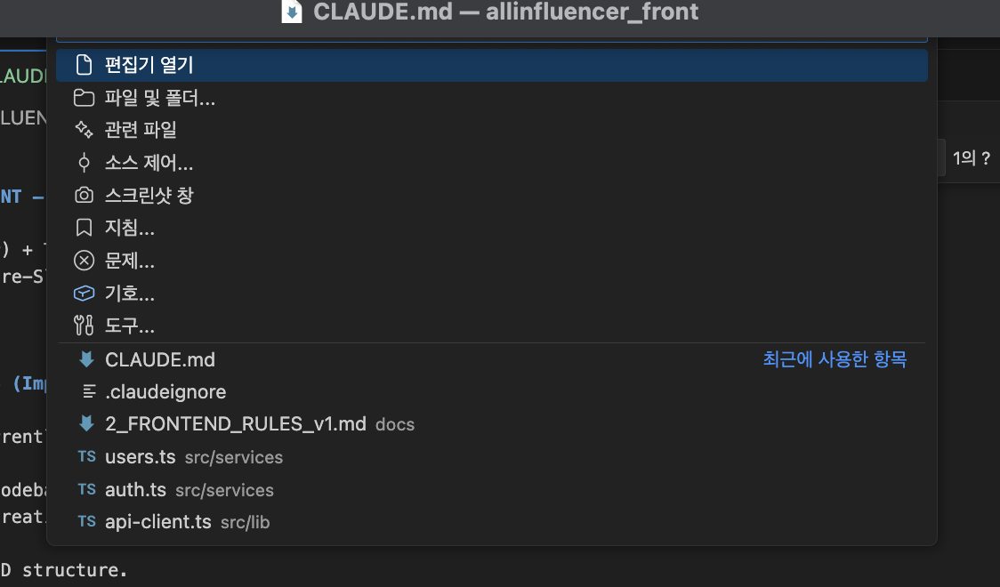

# ALLINFLUENCER_FRONT – Claude Working Rules

Next.js (App Router) + TypeScript + Tailwind + TanStack Query
Architecture: Feature-Sliced Design (FSD) – Migration in Progress

---

## 0. Current State (Important)

This project is currently being refactored to Feature-Sliced Design (FSD).

Some parts of the codebase may still use the previous structure.
When modifying or creating new code:

- Prefer the new FSD structure.
- Do not break working legacy code unless explicitly asked.
- Gradually migrate code when touching related files.

---

## 1. Source of Truth for Rules

Claude must follow BOTH:

1. This CLAUDE.md (architecture & behavior rules)
2. The documents inside:

- docs/1_PRETTIER_SETUP_v1.md
- docs/2_FRONTEND_RULES_v2.md (FSD version)

If there is a conflict:
→ Follow the FSD architecture and latest rules.

---

## 2. Project Stack

- Framework: Next.js (App Router)
- Language: TypeScript
- Styling: Tailwind (primary) + CSS Modules
- Server State: TanStack Query
- Architecture: Feature-Sliced Design (FSD)

---

## 3. Golden Rules (Must Follow)

1. Read the minimum number of files required.
2. Never scan the entire project unless explicitly asked.
3. Never modify:
   - node_modules
   - .next
   - dist/build outputs
   - environment files
4. Do not modify config/tooling unless requested.
5. Keep diffs minimal and localized.
6. Follow FSD placement rules for new files.

---

## 4. FSD Placement Rules

Use the smallest appropriate scope.

### app/

Routing only. Keep thin.

### pages/

Page composition layer (optional).
Used to assemble widgets.

### widgets/

Large UI blocks used to build pages.

### features/

User actions (login, approve, submit, toggle, etc).

### entities/

Domain models (user, job, approval, etc).
May contain:

- model (types)
- api (query hooks)
- ui (entity-specific UI)

### shared/

Global reusable code:

- api-client
- shared ui
- utils
- types
- styles

---

## 5. Migration Rule (Important)

When modifying old-structure code:

- If only small change → keep structure but follow new conventions.
- If significantly modifying → migrate that piece to FSD.
- Do NOT move unrelated files just for structure cleanup unless asked.

---

## 6. TanStack Query Rules

- No direct fetch in page components.
- Query keys must be array-based.
- Queries belong to:
  - entities/<domain>/api (for read models)
  - features/<feature>/api (for action-based mutations)
- On mutation success → invalidate relevant query keys.

---

## 7. Styling Rules

- Prefer Tailwind for layout.
- Use CSS Modules for complex/reusable component styles.
- Avoid inline style={{}} unless trivial.
- Shared tokens belong in shared/styles.

---

## 8. Output Format

Default output format:

1. Diff (or file-by-file patch)
2. Short explanation (max 5 bullets)
3. If needed: migration checklist

---

## 9. What NOT To Do

- Do not introduce Redux.
- Do not reintroduce old architecture patterns.
- Do not mix responsibilities across FSD layers.
- Do not scan entire repo unnecessarily.
